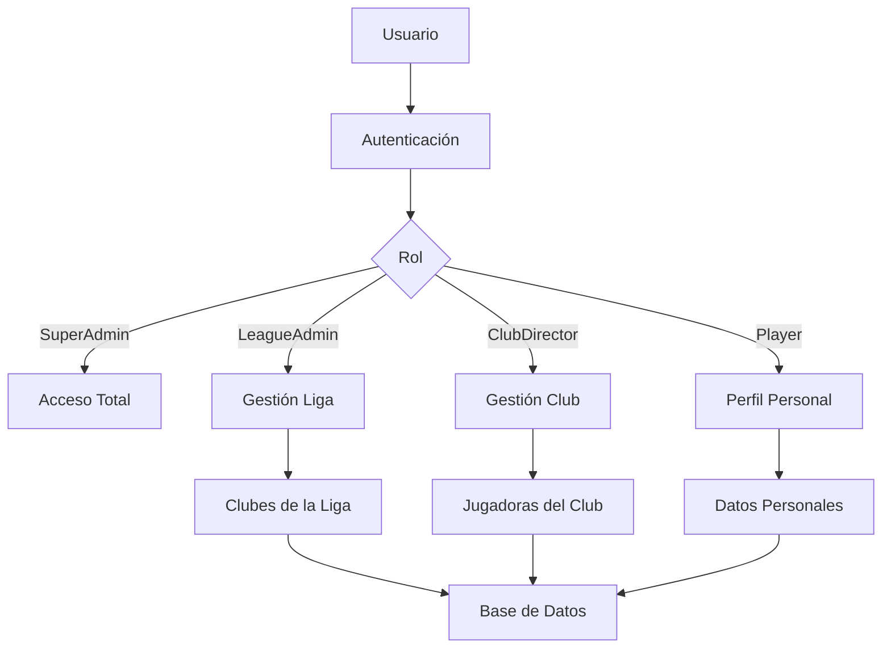

# 🏐 VolleyPass Sucre

<div align="center">


**Plataforma Integral de Gestión para Ligas de Voleibol**
*Sistema de Digitalización y Carnetización Deportiva*

[](https://laravel.com)
[](https://php.net)
[](https://livewire.laravel.com)
[](https://mysql.com)

[🚀 Demo](#) • [📖 Documentación](#) • [🐛 Reportar Bug](#) • [💡 Solicitar Feature](#)

</div>

---

## 📋 Tabla de Contenidos

- [📖 Acerca del Proyecto](#-acerca-del-proyecto)
- [✨ Características](#-características)
- [🏗️ Arquitectura](#-arquitectura)
- [🛠️ Tecnologías](#-tecnologías)
- [⚙️ Instalación](#-instalación)
- [🚀 Inicio Rápido](#-inicio-rápido)
- [📊 Estado del Proyecto](#-estado-del-proyecto)
- [🤝 Contribuir](#-contribuir)
- [📄 Licencia](#-licencia)

---

## 📖 Acerca del Proyecto

**VolleyPass Sucre** es una plataforma integral diseñada para digitalizar y modernizar la gestión de la Liga de Voleibol de Sucre, Colombia. El sistema centraliza el registro, verificación y gestión de jugadoras, entrenadores y clubes, garantizando transparencia, eficiencia y control en torneos oficiales.

### 🎯 Objetivo Principal

Reemplazar el sistema tradicional de carnets físicos por una solución digital robusta que permita:

- ✅ **Control centralizado** de jugadoras y documentación
- ✅ **Verificación instantánea** en partidos mediante códigos QR
- ✅ **Historial deportivo y médico** completo
- ✅ **Transparencia** en el cumplimiento de normativas
- ✅ **Estadísticas avanzadas** para desarrollo deportivo

### 👥 Beneficiarios

- **Jugadoras y entrenadores** de la Liga de Voleibol de Sucre
- **Directivos de clubes** y ligas departamentales
- **Organizadores de torneos** y verificadores oficiales
- **Federaciones deportivas** y patrocinadores

---

## ✨ Características

### 🏗️ **Fase 1: Infraestructura Base** ✅ *Completada*

<details>
<summary><strong>🔐 Sistema de Usuarios Multi-Rol</strong></summary>

- **SuperAdmin**: Acceso total al sistema
- **LeagueAdmin**: Administrador de liga departamental
- **ClubDirector**: Director de club deportivo
- **Player**: Jugadora registrada
- **Coach**: Entrenador certificado
- **SportsDoctor**: Médico deportivo
- **Verifier**: Verificador de carnets en partidos

</details>

<details>
<summary><strong>🏛️ Jerarquía Organizacional</strong></summary>

```
Liga (Departamental)
└── Clubes
    ├── Jugadoras
    ├── Entrenadores
    └── Equipos por Categoría
        ├── Mini (8-10 años)
        ├── Pre-Mini (11-12 años)
        ├── Infantil (13-14 años)
        ├── Cadete (15-16 años)
        ├── Juvenil (17-18 años)
        ├── Mayores (19+ años)
        └── Masters (35+ años)
```

</details>

<details>
<summary><strong>🌍 Ubicaciones Geográficas</strong></summary>

- **Colombia completa**: 32 departamentos, 1,100+ municipios
- **Integración nativa** con códigos DANE
- **Búsquedas inteligentes** por ubicación

</details>

### 🚀 **Fase 2: Carnetización Digital** *En Desarrollo*

- 📄 **Gestión de Documentos**: Cédula, certificados médicos, fotografías
- 🆔 **Carnets Digitales**: Generación automática con códigos QR únicos
- 📱 **Verificación Móvil**: App para verificadores en tiempo real
- 🏥 **Módulo Médico**: Estados de aptitud y alertas de vencimiento

### 🏆 **Fase 3: Gestión Avanzada** *Planeada*

- 📊 **Estadísticas Deportivas**: Rendimiento y rankings
- 🏆 **Torneos y Competencias**: Gestión completa de eventos
- 🏅 **Sistema de Reconocimientos**: MVP, selecciones, awards
- 💰 **Gestión de Pagos**: Inscripciones y cuotas

---

## 🏗️ Arquitectura

### 🗂️ Estructura del Proyecto

```
volleypass/
├── 📁 app/
│   ├── 📁 Enums/           # Estados y tipos de datos
│   ├── 📁 Http/
│   │   └── 📁 Controllers/ # Controladores principales
│   ├── 📁 Models/          # Modelos Eloquent
│   │   ├── User.php        # Usuario con roles
│   │   ├── UserProfile.php # Perfil extendido
│   │   ├── League.php      # Liga deportiva
│   │   ├── Club.php        # Club deportivo
│   │   ├── Player.php      # Jugadora
│   │   └── ...
│   ├── 📁 Traits/          # Funcionalidades reutilizables
│   └── 📁 Providers/       # Service providers
├── 📁 config/              # Configuraciones
├── 📁 database/
│   ├── 📁 migrations/      # Migraciones de BD
│   ├── 📁 seeders/         # Datos iniciales
│   └── 📁 factories/       # Factories para testing
├── 📁 resources/
│   └── 📁 views/           # Vistas Blade + Livewire
└── 📁 routes/              # Definición de rutas
```

### 🔄 Flujo de Datos



---

## 🛠️ Tecnologías

### 🚀 Core Framework
- **[Laravel 11.x](https://laravel.com)** - Framework PHP moderno
- **[Livewire 3.x](https://livewire.laravel.com)** - Componentes reactivos
- **[Volt](https://livewire.laravel.com/docs/volt)** - Sintaxis simplificada

### 📦 Paquetes Principales
- **[Spatie Permission](https://spatie.be/docs/laravel-permission)** - Roles y permisos
- **[Spatie Media Library](https://spatie.be/docs/laravel-medialibrary)** - Gestión de archivos
- **[Spatie Activity Log](https://spatie.be/docs/laravel-activitylog)** - Auditoría
- **[Simple QR Code](https://www.simplesoftwareio.com/simple-qrcode)** - Generación QR

### 🗃️ Base de Datos
- **[MySQL 8.0+](https://mysql.com)** - Base de datos relacional
- **[Redis](https://redis.io)** - Cache y sesiones *(opcional)*

### 🛠️ Desarrollo
- **[Laravel Telescope](https://laravel.com/docs/telescope)** - Debugging
- **[Laravel Debugbar](https://github.com/barryvdh/laravel-debugbar)** - Debug bar
- **[PHPStan](https://phpstan.org)** - Análisis estático *(planeado)*

---

## ⚙️ Instalación

### 📋 Prerequisitos

```bash
# Verificar versiones requeridas
php --version    # PHP 8.2+
composer --version # Composer 2.x
mysql --version    # MySQL 8.0+
node --version     # Node.js 18+ (opcional)
```

### 🚀 Instalación Completa

#### 1️⃣ Clonar el Repositorio

```bash
git clone https://github.com/tu-usuario/volleypass.git
cd volleypass
```

#### 2️⃣ Instalar Dependencias

```bash
# Dependencias PHP
composer install

# Dependencias Node.js (opcional)
npm install && npm run build
```

#### 3️⃣ Configurar Entorno

```bash
# Copiar archivo de configuración
cp .env.example .env

# Generar clave de aplicación
php artisan key:generate

# Crear enlace de almacenamiento
php artisan storage:link
```

#### 4️⃣ Configurar Base de Datos

```bash
# Editar .env con tus credenciales de BD
DB_CONNECTION=mysql
DB_HOST=127.0.0.1
DB_PORT=3306
DB_DATABASE=volleypass
DB_USERNAME=tu_usuario
DB_PASSWORD=tu_password
```

#### 5️⃣ Ejecutar Migraciones y Seeders

```bash
# Crear todas las tablas y datos iniciales
php artisan migrate:fresh --seed
```

#### 6️⃣ Configurar Permisos

```bash
# Permisos de almacenamiento
chmod -R 755 storage bootstrap/cache
```

---

## 🚀 Inicio Rápido

### 🖥️ Servidor de Desarrollo

```bash
# Iniciar servidor
php artisan serve

# Acceder a la aplicación
# http://localhost:8000
```

### 👤 Usuarios de Prueba

El seeder crea automáticamente usuarios de ejemplo:

| Email | Contraseña | Rol |
|-------|------------|-----|
| `admin@volleypass.com` | `password` | SuperAdmin |
| `liga@volleypass.com` | `password` | LeagueAdmin |
| `club@volleypass.com` | `password` | ClubDirector |

### 🧪 Verificar Instalación

```bash
# Ejecutar tests
php artisan test

# Verificar configuración
php artisan config:show

# Comprobar rutas
php artisan route:list
```

### 📊 Telescope (Debugging)

```bash
# Acceder a Telescope
# http://localhost:8000/telescope
```

---

## 📊 Estado del Proyecto

### ✅ **Fase 1 - Infraestructura Base** (Completada)

| Componente | Estado | Progreso |
|------------|--------|----------|
| 🔐 Sistema de Autenticación | ✅ Completado | 100% |
| 👥 Gestión de Roles | ✅ Completado | 100% |
| 🏛️ Estructura Organizacional | ✅ Completado | 100% |
| 🌍 Ubicaciones Geográficas | ✅ Completado | 100% |
| 📦 Integración Spatie | ✅ Completado | 100% |
| 📝 Sistema de Logging | ✅ Completado | 100% |

### 🚧 **Fase 2 - Carnetización Digital** (En Desarrollo)

| Componente | Estado | Progreso |
|------------|--------|----------|
| 📄 Gestión de Documentos | 🚧 En desarrollo | 0% |
| 🆔 Carnets Digitales | ⏳ Pendiente | 0% |
| 📱 Códigos QR | ⏳ Pendiente | 0% |
| 🔍 Sistema de Verificación | ⏳ Pendiente | 0% |

### 📅 **Roadmap**

- **Q1 2025**: Completar Fase 2 (Carnetización)
- **Q2 2025**: Fase 3 (Gestión Avanzada)
- **Q3 2025**: Móvil App (React Native)
- **Q4 2025**: Integración con otras ligas

---

## 🤝 Contribuir

¡Las contribuciones son bienvenidas! Este proyecto sigue las mejores prácticas de desarrollo.

### 📝 Guías de Contribución

1. **Fork** el proyecto
2. **Crea** una rama para tu feature (`git checkout -b feature/AmazingFeature`)
3. **Commit** tus cambios (`git commit -m 'Add some AmazingFeature'`)
4. **Push** a la rama (`git push origin feature/AmazingFeature`)
5. **Abre** un Pull Request

### 🧪 Testing

```bash
# Ejecutar todos los tests
php artisan test

# Tests con cobertura
php artisan test --coverage
```

### 📋 Estándares de Código

- **PSR-12** para estilo de código PHP
- **Laravel conventions** para nombres y estructura
- **Eloquent** preferido sobre Query Builder
- **Comentarios en español** para lógica de negocio

---

## 📞 Soporte

- 📧 **Email**: admin@volleypass.com
- 📱 **WhatsApp**: +57 300 123 4567
- 🌐 **Website**: [volleypass.sucre.gov.co](#)
- 📋 **Issues**: [GitHub Issues](#)

---

## 📄 Licencia

Este proyecto está licenciado bajo la Licencia MIT. Ver [LICENSE](LICENSE) para más detalles.

---

## 🙏 Agradecimientos

- **Liga de Voleibol de Sucre** - Por confiar en esta solución
- **Gobernación de Sucre** - Por el apoyo institucional
- **Comunidad Laravel** - Por las excelentes herramientas
- **Spatie** - Por los paquetes de alta calidad

---

<div align="center">

**🏐 Desarrollado con ❤️ para el voleibol sucreño**

[⬆️ Volver arriba](#-volleypass-sucre)

</div>
